<!-- you're reading the source. good instinct. -->

<picture>
  <source media="(prefers-color-scheme: dark)" srcset="assets/hero-dark.svg">
  
</picture>

**Thinks three moves ahead. Occasionally trips on the first one.**


```text
CASE FILE #1285         CLASSIFIED
----------------------------------
SUBJECT
  Rahi Patel
CLASSIFICATION
  security · engineering ·
  controlled chaos
ACTIVE OPERATIONS
  ███████████  █████  ███████
  details withheld by subject
KNOWN FOR
  · turning "quick ideas" into
    platforms
  · threat-modelling the login
    page before it exists
  · reading the logs nobody reads
OBJECTIVE
  ship what's classified. then
  open-source something.
WEAKNESS
  "I could build that myself."
  he usually can. that is the
  problem.
COMMENDATIONS
  galaxy brain x4 · pull shark x3
  github's words, not mine
STATUS
  building something. ask later.
```

<!-- TODO: keep this README minimal. status: wontfix -->
<!-- 48 61 63 6b 20 74 68 65 20 6d 69 6e 64 73 65 74 2c 20 6e 6f 74 20 6a 75 73 74 20 74 68 65 20 6d 61 63 68 69 6e 65 2e -->