<!-- you're reading the source. good instinct. -->

<picture>
  <source media="(prefers-color-scheme: dark)" srcset="assets/hero-dark.svg">
  
</picture>

**Thinks three moves ahead. Occasionally trips on the first one.**

### `02` Personality.OS

```text
$ cat /proc/self/personality

[planner]   strategy
  has a plan for the plan failing,
  and a third one for that.
  · compiled in Toledo

[bull]      opportunity
  sees the 10x version of an idea
  before the 1x has shipped.
  · no upper limit

[fox]       angles
  reads people, then the system,
  then the fine print.
  · runs underestimated

[retry]     chaos
  gets flattened, pops back into
  shape, tries the same door again.
  · respawned 1285x
```

### `03` How I think

```text
$ man rahi --section=method

  01  observe       touch nothing
  02  map it        who trusts whom
  03  find the gap  there's one
  04  plan          on paper first
 ┌05  build
 │06  break it      like an attacker
 │07  fix it
 └08  bored yet?    no? back to 05
  09  ship          keep reading logs
```

Most of my time goes into the loop between 05 and 08. Breaking my own work is cheaper than waiting for someone else to.

### `04` Case file

```text
CASE FILE #1285         CLASSIFIED
----------------------------------
SUBJECT
  Rahi Patel
CLASSIFICATION
  security · engineering ·
  controlled chaos
KNOWN FOR
  · turning "quick ideas" into
    platforms
  · threat-modelling the login
    page before it exists
  · reading the logs nobody reads
OBJECTIVE
  ship RawStrix. then the first
  open-source repo.
WEAKNESS
  "I could build that myself."
  he usually can. that is the
  problem.
COMMENDATIONS
  galaxy brain x4 · pull shark x3
  github's words, not mine
STATUS
  building something. ask later.
```

### `05` Things I probably shouldn't say

> "The client asked for a simple landing page."<br>
> *narrator: it now has multi-tenant billing, role-based access and an audit log.*

> "Nobody is going to attack the CTF platform."<br>
> *narrator: it was a CTF. everybody attacked the platform.*

> "I'll rotate the keys tomorrow."<br>
> *narrator: he rotated them in four minutes. he has seen things.*

> "Let's keep this README minimal."<br>
> *narrator: you are reading section five.*

### `06` What I build

Enough about the character. Here's the work.

**Security** · pentesting, security reviews, CTF infrastructure, cyber ranges<br>
**Platforms** · multi-tenant systems (CRM, HR, attendance, payroll), APIs, backends, automation<br>
**Apps** · web, Android, iOS, Windows and macOS

### `07` Flagship

<picture>
  <source media="(prefers-color-scheme: dark)" srcset="assets/rawstrix-dark.svg">
  
</picture>

```text
MISSION     somewhere to learn,
            compete, break things
            and get better
OBJECTIVE   security practice that
            feels like an op,
            not a quiz
THREAT      everyone who signs up.
MODEL       that's the point.
STACK       classified, for now
REPO        private
WEBSITE     not live yet
```

### `08` Other work

- **Client systems.** CRMs, HR, attendance and payroll platforms for businesses. Client work, so it stays in private repos.
- **Developer tools and automation**, most of which started as "just a quick script".

### `09` Currently building

```text
$ top -o ambition

rawstrix     [████████░░]  building
client work  [██████████]  shipping
first oss    [██░░░░░░░░]  plotting
sleep        [░░░░░░░░░░]  not found
```

### `10` System info

```text
$ cat ~/.stack
lang     typescript · javascript
         python · shell
targets  web · android · ios
         windows · macos

$ telemetry        synced 2026-10
contributions (12 mo)       1,855
├─ public      █░░░░░░░░░      29
└─ classified  ██████████   1,826
merged pull requests          186
achievements unlocked           7
```

### `11` Open a secure channel

[rahipatel1285.dev](https://rahipatel1285.dev) · [X](https://x.com/rahipatel1285) · [LinkedIn](https://www.linkedin.com/in/rahipatel1285) · [Email](mailto:rahipatel1285@gmail.com)

<details>
<summary><code>/var/log/incidents</code></summary>
<br>

```text
INC-0042  deployed on a friday.
          survived. told nobody.
INC-0107  "quick fix" took nine
          hours. root cause: the
          word "quick".
INC-0451  fixed a bug by renaming
          a variable. not asking.
INC-1285  you opened the incident
          log. clearance upgraded.
```

</details>

<sub>(END) press q to quit</sub>

<!-- TODO: keep this README minimal. status: wontfix -->
<!-- 48 61 63 6b 20 74 68 65 20 6d 69 6e 64 73 65 74 2c 20 6e 6f 74 20 6a 75 73 74 20 74 68 65 20 6d 61 63 68 69 6e 65 2e -->
